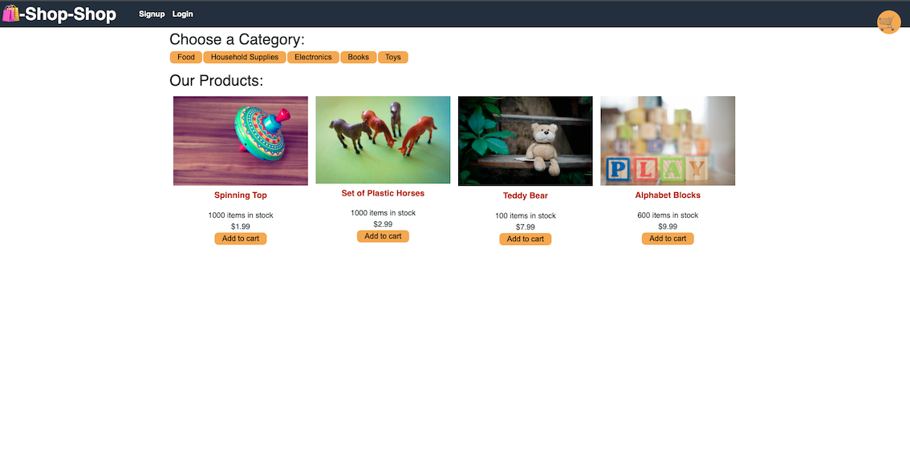

# Redux-Store

## Table of Contents
  
1. [Description](#description)
2. [Usage](#usage)
3. [License](#license)
4. [Contributing Guidelines](#contributing-guidelines)
5. [Test Instructions](#test-instructions)
6. [Questions](#questions)
  
## Description

*  This application refactors an existing E-Commerce application built on React's Context API into one leveraging Redux for global state management.

## Usage

[Deployment](https://stormy-castle-33926.herokuapp.com/)

## License
  
* MIT
  
## Contributing Guidelines

* Fork the repository, commit contributions, create a pull request.

## Test Instructions

* Fork the repository, create tests, submit an issue. 
  
## Questions

Contact information for questions:

* Email: 04-scones.card@newengood.com
* Github: https://github.com/newengood
  
  

